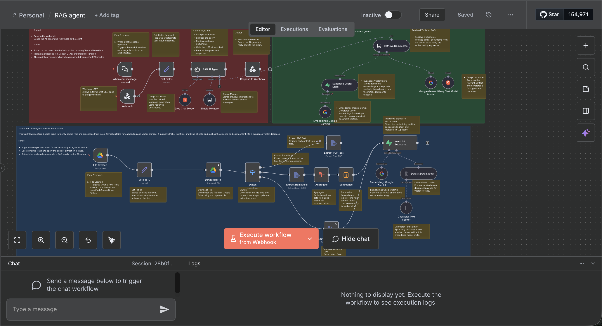

# RAG Agent with Document Processing

A Retrieval-Augmented Generation (RAG) workflow built with n8n that automatically processes documents from Google Drive, stores them in a vector database, and powers an intelligent chatbot that answers questions based strictly on your uploaded documents.

## Demo

### Workflow Screenshot



### Video Demonstration

[Watch the workflow in action](https://www.youtube.com/watch?v=YOUR_VIDEO_ID)

## Overview

This n8n workflow implements a complete RAG pipeline that:

1. Monitors Google Drive for new documents (PDF, Excel, Google Docs)
2. Extracts and processes text from various file formats
3. Generates embeddings using Google Gemini
4. Stores document vectors in Supabase for semantic search
5. Provides a chat interface for querying documents
6. Uses Groq LLM to generate accurate answers based only on retrieved document context

## Features

- **Multi-format Support**: Handles PDF, Excel (XLSX), Google Docs, and plain text files
- **Automatic Processing**: Monitors Google Drive and processes new files automatically
- **Intelligent Text Splitting**: Breaks large documents into optimized chunks for embedding
- **Vector Storage**: Uses Supabase for efficient similarity search
- **Contextual Responses**: AI only answers based on uploaded document content
- **Conversation Memory**: Maintains context across multiple chat messages
- **Dual Interface**: Supports both chat trigger and webhook endpoints

## Architecture

The workflow consists of two main components:

### 1. Document Processing Pipeline

Handles ingestion and embedding of documents into the vector store:

- Monitors Google Drive folder for new files
- Routes files to appropriate extraction method based on type
- Splits large documents into manageable chunks
- Generates vector embeddings
- Stores in Supabase vector database

### 2. RAG Chat Interface

Provides intelligent question-answering capabilities:

- Receives user queries via chat or webhook
- Embeds the query using Google Gemini
- Retrieves relevant document chunks from Supabase
- Generates contextual responses using Groq LLM
- Returns answers based strictly on document content

## Prerequisites

Before setting up this workflow, ensure you have:

- n8n instance (self-hosted or cloud)
- Google Cloud account with Drive API enabled
- Google Gemini API access
- Supabase account with vector extension enabled
- Groq API access

## Required Credentials

Configure the following credentials in n8n:

1. **Google Drive OAuth2 API**
   - OAuth2 authentication for file monitoring and downloads
   - Permissions: Read files from specified folders

2. **Google Gemini API (PaLM API)**
   - API key for generating text embeddings
   - Used for both document and query vectorization

3. **Supabase API**
   - Project URL and service role key
   - Vector extension must be enabled

4. **Groq API**
   - API key for LLM access
   - Model: llama-3.3-70b-versatile

## Installation

### Step 1: Set Up Supabase

Create a table in Supabase for storing document embeddings:

```sql
-- Enable the pgvector extension
create extension if not exists vector;

-- Create the documents table
create table documents (
  id bigserial primary key,
  content text,
  metadata jsonb,
  embedding vector(768)
);

-- Create the match_documents function
create or replace function match_documents (
  query_embedding vector(768),
  match_threshold float,
  match_count int
)
returns table (
  id bigint,
  content text,
  metadata jsonb,
  similarity float
)
language sql stable
as $$
  select
    documents.id,
    documents.content,
    documents.metadata,
    1 - (documents.embedding <=> query_embedding) as similarity
  from documents
  where 1 - (documents.embedding <=> query_embedding) > match_threshold
  order by similarity desc
  limit match_count;
$$;

-- Create an index for faster similarity search
create index on documents using ivfflat (embedding vector_cosine_ops)
with (lists = 100);
```

### Step 2: Import the Workflow

1. Open your n8n instance
2. Navigate to Workflows
3. Click "Add Workflow" > "Import from File"
4. Select the provided JSON file
5. The workflow will be imported with all nodes configured

### Step 3: Configure Credentials

Update the credential references in the workflow:

- `YOUR_GOOGLE_DRIVE_CREDENTIAL_ID` - Google Drive OAuth2 credentials
- `YOUR_GOOGLE_GEMINI_CREDENTIAL_ID` - Google Gemini API credentials
- `YOUR_SUPABASE_CREDENTIAL_ID` - Supabase API credentials
- `YOUR_GROQ_CREDENTIAL_ID` - Groq API credentials

### Step 4: Update Configuration Parameters

Replace placeholder values in the workflow:

- `YOUR_GOOGLE_DRIVE_FILE_ID` - Specific file ID (if monitoring a single file)
- `YOUR_FOLDER_ID` - Google Drive folder ID to monitor
- `YOUR_WEBHOOK_ID` - Generate a new webhook ID
- `YOUR_WEBHOOK_PATH` - Custom webhook path (optional)

### Step 5: Activate the Workflow

1. Save the workflow
2. Click "Activate" to enable the Google Drive trigger
3. Note the webhook URL for integration with your chat interface

## Configuration

### Google Drive Setup

1. Create a dedicated folder in Google Drive for documents
2. Copy the folder ID from the URL: `https://drive.google.com/drive/folders/FOLDER_ID`
3. Update the "File Created" trigger node with this folder ID
4. The workflow will monitor this folder every minute for new files

### Supported File Types

The workflow handles three document types:

- **PDF Files**: `application/pdf`
- **Excel Files**: `application/vnd.openxmlformats-officedocument.spreadsheetml.sheet`
- **Google Docs**: `application/vnd.google-apps.document`

The Switch node automatically routes each file type to the appropriate extraction method.

### Vector Store Configuration

In the Supabase Vector Store nodes, you can adjust:

- `topK`: Number of similar documents to retrieve (default: 4)
- `queryName`: Name of the Supabase function (default: match_documents)
- Table name: documents (or customize as needed)

### LLM Configuration

The RAG AI Agent uses a system prompt that enforces document-only responses:

```
You are a personal AI assistant specialized in answering questions based only on the content of the provided PDF document(s).

Follow these rules:
1. Use only the information contained in the uploaded or retrieved PDF(s) to answer the user's questions.
2. If the question cannot be answered from the PDF(s), or if it is unrelated to the content, reply:
   "I'm sorry, I can only answer questions based on the uploaded PDF document(s)."
3. Always provide clear, concise, and factual answers strictly grounded in the document text.
4. If multiple PDFs are uploaded, synthesize information across them when relevant.
```

You can modify this prompt to adjust the assistant's behavior.

## Usage

### Adding Documents

1. Upload files to your monitored Google Drive folder
2. The workflow automatically:
   - Detects the new file
   - Downloads and extracts text
   - Splits into chunks (if large)
   - Generates embeddings
   - Stores in Supabase

### Querying Documents

#### Via Chat Interface

1. Navigate to the workflow's chat URL (provided when activated)
2. Type your question
3. Receive AI-generated answers based on your documents

#### Via Webhook

Send POST requests to the webhook URL:

```bash
curl -X POST https://your-n8n-instance.com/webhook/YOUR_WEBHOOK_PATH \
  -H "Content-Type: application/json" \
  -d '{
    "chatInput": "What is the main topic of the document?",
    "sessionId": "user-123"
  }'
```

The `sessionId` helps maintain conversation context across multiple queries.

## Workflow Node Breakdown

### Document Processing Flow

1. **File Created** - Triggers when a new file appears in Google Drive
2. **Set File ID** - Extracts file ID and MIME type for routing
3. **Download File** - Downloads the file from Google Drive
4. **Switch** - Routes to appropriate extraction node based on file type
5. **Extract PDF Text** - Processes PDF files
6. **Extract from Excel** - Processes XLSX files
7. **Extract Document Text** - Processes text and Google Docs
8. **Aggregate** - Combines multi-sheet Excel data
9. **Summarize** - Concatenates text for embedding
10. **Character Text Splitter** - Splits large texts into chunks
11. **Default Data Loader** - Prepares document with metadata
12. **Embeddings Google Gemini** - Generates vector embeddings
13. **Insert into Supabase Vectorstore** - Stores in database

### Chat Interface Flow

1. **When chat message received** - Chat trigger endpoint
2. **Webhook** - Alternative HTTP endpoint
3. **Edit Fields** - Normalizes input format
4. **RAG AI Agent** - Main orchestration logic
5. **Embeddings Google Gemini1** - Embeds user query
6. **Supabase Vector Store** - Retrieves similar documents
7. **Retrieve Documents** - Tool for document retrieval
8. **Google Gemini Chat Model** - Language model for retrieval
9. **Groq Chat Model1** - Generates final response
10. **Simple Memory** - Maintains conversation context
11. **Respond to Webhook** - Returns answer to user

## Customization

### Adjusting Chunk Size

Modify the "Character Text Splitter" node parameters:

```javascript
{
  "chunkSize": 1000,      // Characters per chunk
  "chunkOverlap": 200     // Overlap between chunks
}
```

### Changing the LLM Model

In the "Groq Chat Model1" node, you can select different models:

- `llama-3.3-70b-versatile` (default)
- `llama-3.1-70b-versatile`
- `mixtral-8x7b-32768`

### Modifying Retrieval Settings

In the "Retrieve Documents" node:

- `topK`: Increase to retrieve more context (may slow responses)
- `name`: Change the tool name visible to the LLM
- `description`: Modify to adjust how the LLM understands the tool

## Error Handling

The workflow includes built-in error handling:

- **File Download Failures**: Logged but don't stop processing
- **Extraction Errors**: Falls back to raw text extraction
- **Embedding Failures**: Logged with file ID for debugging
- **Query Errors**: Returns helpful error messages to users

Check n8n execution logs for detailed error information.

## Troubleshooting

### Common Issues

**Issue**: Google Drive trigger not firing

- Verify OAuth2 credentials are valid and not expired
- Check that the folder ID is correct
- Ensure polling is set to an appropriate interval

**Issue**: Embeddings fail with quota errors

- Check Google Gemini API quota limits
- Consider implementing rate limiting
- Verify API key has proper permissions

**Issue**: Supabase connection fails

- Confirm the vector extension is enabled
- Verify the match_documents function exists
- Check that the service role key has proper permissions
- Ensure the documents table schema matches expectations

**Issue**: Chat returns "cannot answer" for valid questions

- Verify documents were successfully embedded
- Check if relevant content exists in the database
- Increase `topK` value to retrieve more documents
- Review the similarity threshold in match_documents function

**Issue**: Responses are slow

- Reduce `topK` to retrieve fewer documents
- Optimize chunk sizes in text splitter
- Consider using a faster LLM model
- Check Supabase query performance

## API Rate Limits

Be aware of the following rate limits:

- **Google Drive API**: 10,000 requests per 100 seconds
- **Google Gemini API**: Varies by tier (check your quota)
- **Groq API**: Varies by plan (typically 30 requests/minute)
- **Supabase**: Based on your plan (free tier: 500MB database)

## Performance Optimization

### For Large Document Collections

1. Increase the vector index lists parameter in Supabase
2. Use larger chunk sizes to reduce total chunks
3. Implement document metadata filtering
4. Consider pre-filtering by document type or date

### For Faster Responses

1. Reduce `topK` to minimum needed documents
2. Use a faster embedding model if available
3. Optimize Supabase queries with proper indexes
4. Consider caching frequent queries

## Security Considerations

- Store all API keys securely in n8n credentials manager
- Use service role keys (not anon keys) for Supabase
- Implement authentication for webhook endpoints if public
- Regularly rotate API keys
- Monitor usage for anomalies
- Restrict Google Drive folder access appropriately

## Data Privacy

This workflow:

- Stores document content in your Supabase instance
- Sends text to Google Gemini for embedding
- Sends queries and context to Groq for response generation
- Maintains conversation history in memory during sessions

Ensure compliance with applicable data protection regulations when processing sensitive documents.

## Limitations

- Maximum file size depends on n8n execution timeout settings
- Very long documents may hit embedding API limits
- Chat memory is session-based (not persistent across restarts)
- Vector similarity depends on embedding model quality
- LLM responses are limited by model context window

## Extending the Workflow

### Add More File Types

1. Add new condition in Switch node
2. Add appropriate extraction node
3. Connect to the embedding pipeline

### Implement Document Metadata

Enhance the "Default Data Loader" node to include:

```javascript
{
  "file_id": "...",
  "upload_date": "...",
  "file_type": "...",
  "author": "..."
}
```

### Add Document Filtering

Modify the Supabase function to filter by metadata:

```sql
where 1 - (documents.embedding <=> query_embedding) > match_threshold
  and metadata->>'file_type' = 'pdf'
```

### Implement Multi-language Support

Add language detection and use appropriate embedding models per language.

## Contributing

To improve this workflow:

1. Fork the workflow in n8n
2. Make your modifications
3. Test thoroughly with various document types
4. Export and share the updated JSON
5. Document your changes

## License

This project is provided as-is for educational and commercial use.

## Support

For issues and questions:

- Check n8n community forums for n8n-specific issues
- Review Supabase documentation for database questions
- Consult Google Gemini and Groq API docs for model issues
- Verify all credentials and configurations

## Acknowledgments

Built with:

- n8n workflow automation platform
- Google Gemini API for embeddings
- Groq API for language model inference
- Supabase for vector storage and search
- pgvector extension for similarity search

## Version History

- **v1.0.0** - Initial release with PDF, Excel, and Google Docs support
- Full RAG pipeline with conversation memory
- Dual interface (chat and webhook)
